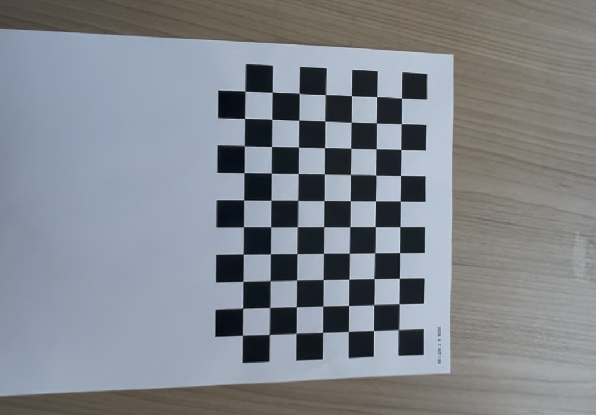
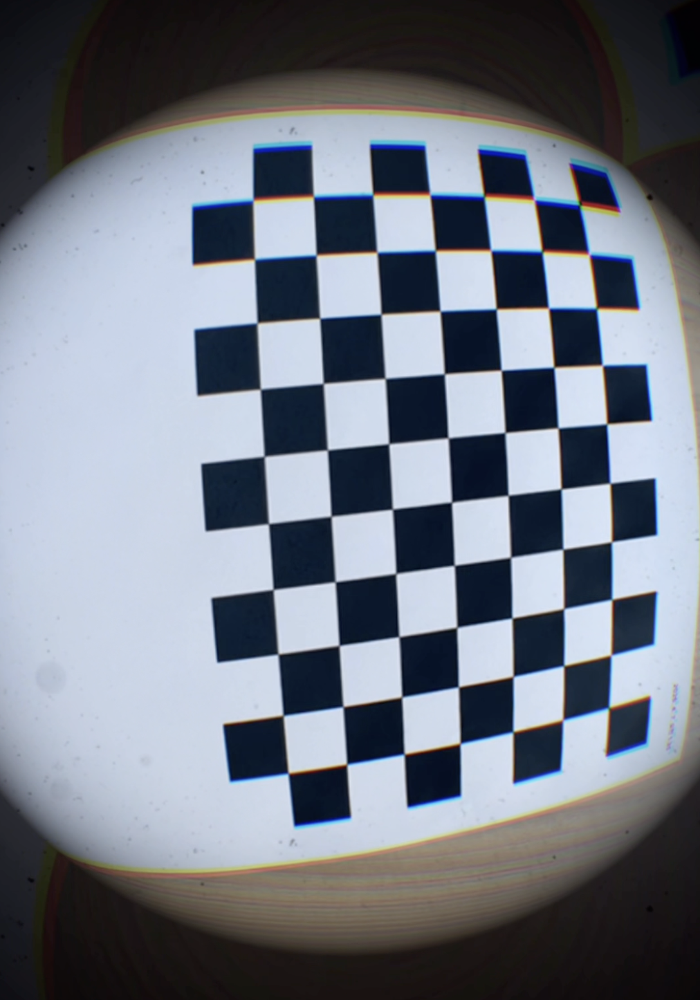
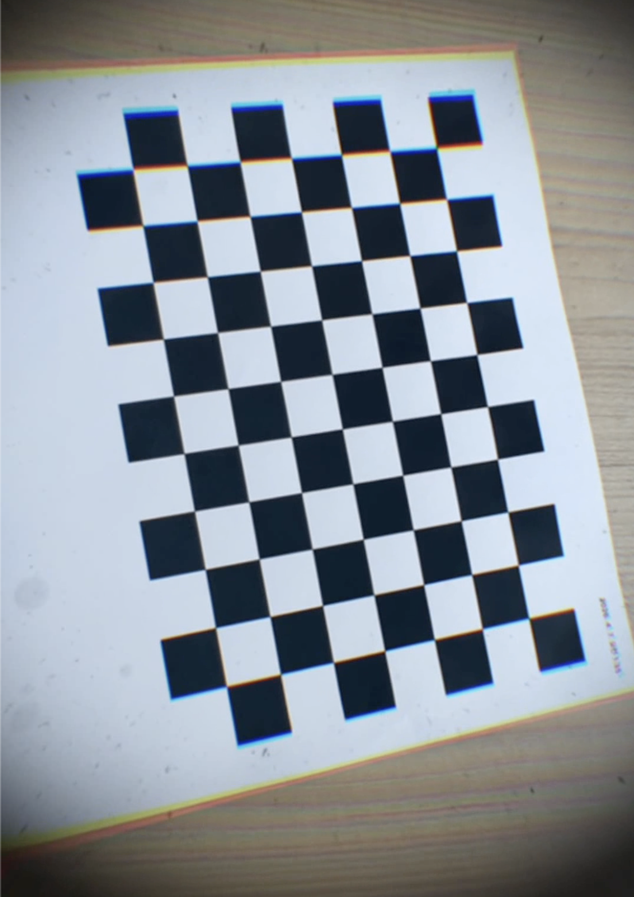

# Simple Cali
파이썬의 openCV 라이브러리를 사용하여 간단한 칼리브레이션과 왜곡 보정을 하는 프로그램입니다

### 사용 기술
- 파이썬
- openCV
- numpy

### 동작 파이프라인
프레임 추출
- 동영상에서 매 10프레임마다 이미지 한장을 추출합니다

캘리브레이션
- 추출된 이미지에서 캘리브레이션을 진행하여 카메라 행렬 K와 왜곡계수를 구합니다

왜곡 제거
- 원본 동영상에 언디스토션을 적용하고 동영상 파일을 저장합니다

### 결과
1. 플랫 비디오

RMS error : 0.7193  
fx, fy    : 904.18, 900.56  
cx, cy    : 544.99, 957.85  
dist_coeff: [-0.0047  0.0134 -0.0002  0.0014 -0.0113]  
num images: 28

2. 피쉬아이 비디오
  

RMS error : 0.9183  
fx, fy    : 2532.30, 2523.58   
cx, cy    : 543.92, 965.66  
dist_coeff: [-1.3561e+00 -4.6463e+00 -3.5000e-03 -3.8000e-03 -2.2786e+00]  
num images: 40